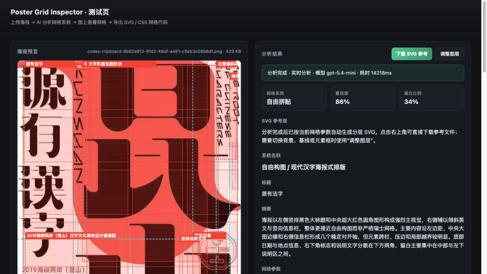
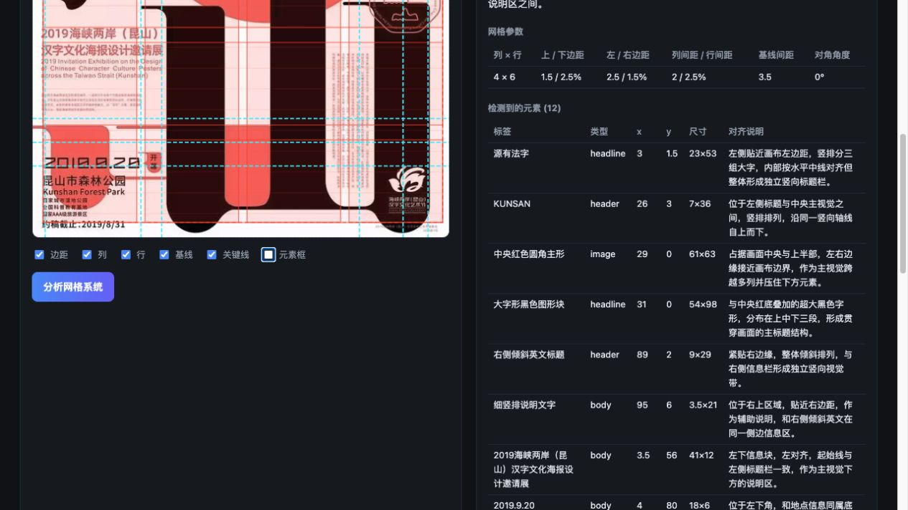
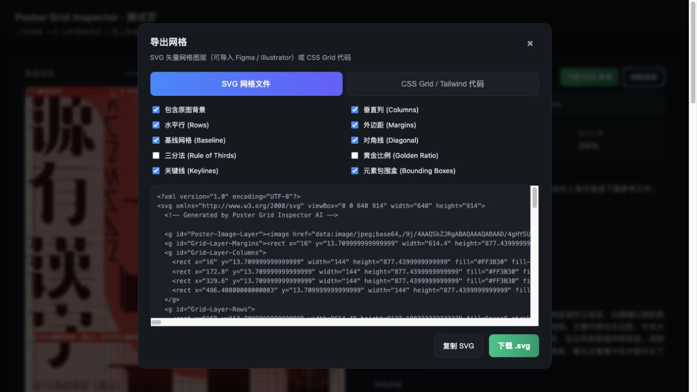
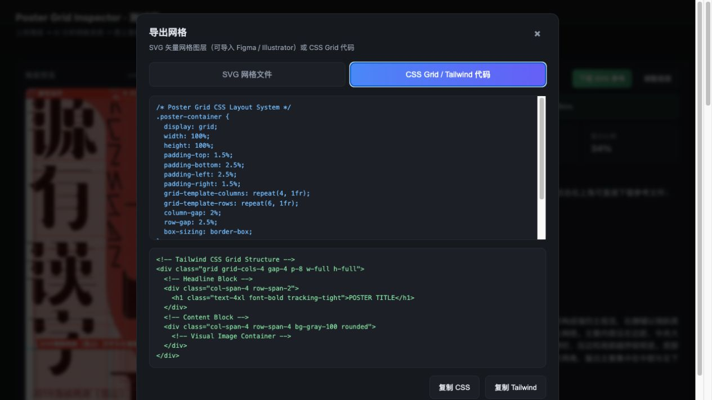

<div align="center">

# 🧩 Poster Grid Inspector

**Model-agnostic AI poster grid analysis · 海报网格系统分析**

Detect the underlying **layout grid system** of any poster / design image with a vision model —
then view the grid overlaid on the image and **export it as SVG guides or CSS Grid / Tailwind code**.

The installable skill defaults to the host model's native vision capability. It does not upload
conversation images or call a remote API. The web UI and CLI remain available as explicit,
opt-in remote-provider tools.

[](LICENSE)
[](package.json)
[](#install-as-a-skill)

</div>

---

## Table of Contents

- [What it does](#what-it-does)
- [Features](#features)
- [Architecture](#architecture)
- [Project structure](#project-structure)
- [Quick start](#quick-start)
- [Usage](#usage)
  - [Web UI](#1-web-ui-recommended)
  - [CLI](#2-cli)
  - [API](#3-api)
- [Configuration](#configuration-env)
- [Grid export](#grid-export)
- [Model providers](#model-providers)
- [Install as a skill](#install-as-a-skill)
- [For AI agents](#for-ai-agents)
- [Security](#security)
- [Troubleshooting](#troubleshooting)
- [FAQ](#faq)
- [Contributing](#contributing)
- [License](#license)

---

## What it does

Upload (or point an agent at) a poster image, and the tool uses a **multimodal vision model** to
deconstruct the image's layout:

- **Grid system type** — Swiss modular, 12/6/3-column, asymmetric, baseline grid, golden ratio,
  rule of thirds, diagonal/isometric, radial, freeform/organic.
- **Grid parameters** — columns, rows, margins, gutters, baseline spacing, diagonal angle
  (all as percentages of the image).
- **Detected elements** — headline, body, image, logo, accent, header, footer with bounding boxes
  and per-element alignment notes.
- **Keylines** — the horizontal / vertical alignment axes the layout snaps to.
- **Extra analysis** — Swiss principles applied, type hierarchy rating, whitespace ratio, color palette.

Then it draws the grid **overlaid directly on the poster** and lets you export it:

- **SVG guide** with individually toggleable layers (columns, rows, margins, baseline, diagonal,
  golden ratio, rule of thirds, keylines, element boxes) — importable into **Figma / Illustrator**.
- **CSS Grid** and **Tailwind** scaffold code — copy-paste to start building.

It is **model-agnostic**: it works with **OpenAI** or any **OpenAI-compatible** multimodal model
(Qwen-VL, etc.), and requires **no AI SDK** — just native `fetch`.

> ⚠️ The skill itself uses the host model and needs no API key. The optional web UI / CLI mode
> requires a local `.env`; no API keys are bundled or committed.

---

## Features

- 🖼️ **Vision-model analysis** of grid systems, elements, keylines, palette.
- 🎨 **Web UI** with live grid overlay, layer toggles, and an export dialog.
- 📐 **Export** SVG grid guides (Figma/Illustrator ready) or CSS Grid / Tailwind code.
- ⚡ **CLI** (`npm run analyze -- ./poster.jpg --summary`) — no server required.
- 🔌 **Provider-agnostic** — OpenAI Responses API + OpenAI-compatible Chat Completions.
- 🛡️ **Robust pipeline** — timeout, one retry, schema validation, normalization, in-memory cache
  (cache keyed by image + provider + model + prompt/schema version).
- 🧩 **Agent-ready** — ships as an installable skill (`SKILL.md`) + `AGENTS.md`.

---

## Architecture

```
                        ┌───────────────────────────────────────────────┐
   poster image ───────▶│  Web UI (public/)   or   CLI (scripts/)        │
                        │  prepareImageForVisionApi (1600px JPEG 0.9)    │
                        └───────────────────────┬───────────────────────┘
                                                │ POST /api/analyze-grid
                                                ▼
                        ┌───────────────────────────────────────────────┐
                        │  Express (server.ts)                          │
                        │  analyzeGridRouter (server/routes/)           │
                        └───────────────────────┬───────────────────────┘
                                                ▼
                        ┌───────────────────────────────────────────────┐
                        │  analyzePoster (server/ai/analyzePoster.ts)   │
                        │   · cache check → miss → provider call        │
                        │   · timeout + 1 retry · deadline              │
                        │   · normalize → validate (schema)             │
                        └───────────────────────┬───────────────────────┘
                                                ▼
              ┌─────────────────────────────────┴─────────────────────────────────┐
              ▼                                                                     ▼
  OpenAI provider (server/ai/providers/openai.ts)          OpenAI-compatible (server/ai/providers/openaiCompatible.ts)
  · Responses API  /responses                             · Chat Completions /chat/completions
  · input_image + json_schema                             · image_url + json_object / json_schema
```

The analysis returns a JSON object where **all coordinates are percentages (0–100)**
of the image. UI drawing fields (`color`, `opacity`, `strokeWidth`, show-* toggles) are filled by
the frontend, never by the model.

---

## Project structure

```
poster-grid-inspector/
├── SKILL.md                 # Agent skill entry (frontmatter + usage guide)
├── AGENTS.md                # Onboarding file for AI coding agents
├── README.md                # This file
├── package.json             # Run scripts (setup / start / analyze / typecheck)
├── server.ts                # Web server entry (Express + static + API + /health)
├── public/                  # Frontend UI (vanilla HTML/JS, no bundler)
├── server/
│   ├── ai/
│   │   ├── config.ts        # .env → AiConfig
│   │   ├── providers/       # openai.ts, openaiCompatible.ts, http.ts, index.ts
│   │   ├── analyzePoster.ts # orchestration: cache → provider → normalize → validate
│   │   ├── schema.ts        # JSON Schema + runtime validation
│   │   ├── normalize.ts     # coordinate/field cleanup + systemName migration
│   │   ├── cache.ts         # in-memory cache (keyed, LRU-ish)
│   │   └── errors.ts        # AiError + HTTP error classification
│   └── routes/analyzeGrid.ts
├── src/                     # Types + client-side helpers (visionImage, analyzeGridApi, gridScoring)
├── api/index.ts             # Vercel/Serverless Express example
├── scripts/                 # setup.sh, run.sh, analyze.mts (CLI)
├── prompts/                 # human-readable system prompt
└── .env.example             # env template (empty keys)
```

---

## Quick start

**Prerequisites for optional remote mode:** Node.js ≥ 18 (native `fetch`) and a
**vision-capable** model API key. Host-model skill use needs neither.

```bash
git clone https://github.com/Ygria/poster-grid-inspector.git
cd poster-grid-inspector
npm run setup        # install deps + create .env from .env.example
# edit .env — set AI_REMOTE_ANALYSIS=1 and the provider variables
npm start            # open http://localhost:8787
```

Or run without the web server:

```bash
npm run analyze -- ./poster.jpg --summary
```

---

## Usage

### 1. Web UI (recommended)

1. Set `AI_REMOTE_ANALYSIS=1` in `.env`.
2. `npm start` → open `http://localhost:8787`.
3. Click / drag a poster image onto the drop zone.
4. Click **分析网格系统** (analyze). The grid overlays the image live — toggle columns, rows,
   margins, baseline, keylines, and element boxes above the preview.
4. Click **下载 SVG 参考** for the automatic reference artifact, or click **调整图层** to
   choose SVG layers and copy **CSS Grid / Tailwind** code.

The frontend preprocesses images to ~1600px JPEG (quality 0.9) before sending
(`src/utils/visionImage.ts`), and protects against out-of-order responses
(`src/services/analyzeGridApi.ts`).

分析完成后，界面会自动生成一份基于已校验坐标的 SVG 参考层。点击“下载 SVG 参考”可直接
下载默认图层；点击“调整图层”可以选择是否包含原图、列、行、基线、关键线和元素包围盒，
并导出 Figma / Illustrator 可用的分层 SVG。

#### Runtime result



网格叠加层会直接显示在原海报上，便于判断模型推断出的栏、行、基线和元素边界是否合理：



SVG 和 CSS / Tailwind 导出分别提供可复制、可下载的参考结果：





### 2. CLI

```bash
AI_REMOTE_ANALYSIS=1 npm run analyze -- ./poster.jpg --summary   # concise result
AI_REMOTE_ANALYSIS=1 npm run analyze -- ./poster.png             # full JSON
```

The CLI calls the analysis pipeline directly (no server needed). It sends the file as-is;
very large images should be pre-resized.

### 3. API

```
POST /api/analyze-grid
Content-Type: application/json

{ "imageBase64": "<base64, no data: prefix>", "mimeType": "image/jpeg" }
```

Example:

```bash
IMG_B64=$(base64 < ./poster.jpg)
curl -s http://localhost:8787/api/analyze-grid \
  -H 'Content-Type: application/json' \
  -d "{\"imageBase64\":\"$IMG_B64\",\"mimeType\":\"image/jpeg\"}"
```

Response:

```jsonc
{
  "success": true,
  "data": {
    "systemType": "swiss_modular",              // grid system type
    "systemName": "瑞士模块化网格",              // localized system name
    "confidence": 87,                            // 0–100
    "title": "…", "summary": "…",
    "gridParams": {                              // all percentages 0–100
      "columns": 12, "rows": 8,
      "marginTop": 8, "marginBottom": 6,
      "marginLeft": 5, "marginRight": 5,
      "columnGutter": 2, "rowGutter": 2,
      "baselineSpacing": 2.5, "diagonalAngle": 0
    },
    "detectedElements": [
      { "id": "e1", "label": "…", "type": "headline",
        "x": 46, "y": 3, "width": 49, "height": 10,
        "alignmentNote": "…" }
    ],
    "keylines": [
      { "id": "k1", "type": "vertical", "position": 50, "label": "…" }
    ],
    "swissPrinciples": ["…"],
    "typeHierarchyRating": "A级：…",
    "whitespaceRatio": "24%",
    "colorPalette": ["#161012", "#F0D93B"]
  },
  "meta": {
    "provider": "openai", "model": "gpt-4o-mini",
    "latencyMs": 13313, "cached": false,
    "promptVersion": "poster-grid-v2", "schemaVersion": "poster-grid-schema-v2",
    "requestId": "…"
  }
}
```

Error response shape (with HTTP status):

```jsonc
{ "success": false, "code": "AI_RATE_LIMIT", "error": "…", "retryable": true }
```

| Code | Meaning |
|---|---|
| `INVALID_IMAGE` | missing / non-string `imageBase64` (400) |
| `AI_AUTH_ERROR` | bad API key (401/403) |
| `AI_TIMEOUT` | request timed out (504) |
| `AI_RATE_LIMIT` | provider rate limit (429, retryable) |
| `AI_UPSTREAM_ERROR` | provider 5xx (502, retryable) |
| `AI_INVALID_OUTPUT` | unparseable / failed validation (422) |
| `AI_REQUEST_ERROR` / `AI_NETWORK_ERROR` | generic / network failure |
| `INTERNAL_ERROR` | unexpected server error |

Also available: `GET /health` → `{ ok, provider, model }`.

---

## Configuration (`.env`)

| Env var | Default | Notes |
|---|---|---|
| `AI_REMOTE_ANALYSIS` | `0` | Must be `1`/`true`/`yes`/`on` to allow remote image analysis |
| `AI_PROVIDER` | `openai` | `openai` or `openai-compatible` |
| `AI_API_KEY` | — | **required** |
| `AI_BASE_URL` | `https://api.openai.com/v1` | for compatible providers |
| `AI_MODEL` | `gpt-5.6-terra` | use a **vision** model available to your key |
| `AI_RESPONSE_FORMAT` | `json_schema` | `json_schema` or `json_object` (Qwen) |
| `AI_IMAGE_DETAIL` | `original` | `low` / `high` / `auto` / `original` |
| `AI_ENABLE_THINKING` | `false` | Qwen `enable_thinking` |
| `AI_TIMEOUT_MS` | `35000` | per-request timeout |
| `AI_TOTAL_DEADLINE_MS` | `50000` | total deadline incl. retry |
| `AI_MAX_RETRIES` | `1` | capped at 1 |
| `PROMPT_VERSION` | `poster-grid-v2` | cache key component |
| `SCHEMA_VERSION` | `poster-grid-schema-v2` | cache key component |
| `PORT` | `8787` | web server port |

**OpenAI example:**

```env
AI_PROVIDER=openai
AI_API_KEY=sk-...
AI_BASE_URL=https://api.openai.com/v1
AI_MODEL=gpt-4o-mini
AI_RESPONSE_FORMAT=json_schema
```

**Qwen / OpenAI-compatible example:**

```env
AI_PROVIDER=openai-compatible
AI_API_KEY=...
AI_BASE_URL=https://your-endpoint/v1
AI_MODEL=qwen3-vl-plus
AI_RESPONSE_FORMAT=json_object
AI_ENABLE_THINKING=false
```

---

## Grid export

The export dialog (or the SVG generator behind it) builds layered guides:

| Layer | `<g id>` | Description |
|---|---|---|
| Poster background | `Poster-Image-Layer` | embeds the original image |
| Margins | `Grid-Layer-Margins` | outer content rectangle + margin labels |
| Columns | `Grid-Layer-Columns` | per-column fills + `C1…Cn` labels |
| Rows | `Grid-Layer-Rows` | per-row strokes + `R1…Rn` labels |
| Baseline | `Grid-Layer-Baseline` | typographic baseline lines |
| Diagonal | `Grid-Layer-Diagonal` | angled axes (rotated group) |
| Golden ratio | `Grid-Layer-GoldenRatio` | φ divisions |
| Rule of thirds | `Grid-Layer-RuleOfThirds` | 1/3 divisions |
| Keylines | `Grid-Layer-Keylines` | detected alignment axes |
| Element boxes | `Detected-Poster-Elements` | detected element bounding boxes |

Exported SVG groups have stable IDs so they land as **named layers in Figma / Illustrator**.
CSS / Tailwind output generates a `.poster-container` grid scaffold.

---

## Model providers

| Provider | Endpoint | Images | Output format |
|---|---|---|---|
| `openai` | `POST {base}/responses` | `input_image` | `json_schema` (strict) |
| `openai-compatible` | `POST {base}/chat/completions` | `image_url` | `json_object` or `json_schema` |

Implementation notes:

- Uses **native `fetch`** — no AI SDK dependency (`package.additions.json`).
- Compatible vendors differ on `enable_thinking`, `json_schema`, and image field support; adapt
  within `server/ai/providers/*.ts` if needed.
- **The provider must accept image input.** Text-only APIs (e.g. DeepSeek `deepseek-chat`) fail
  with `unknown variant 'image_url'`.
- Not all keys have access to all models — a key may return `429 insufficient_quota` for some
  models and work fine for others (e.g. `gpt-4o-mini` vs `gpt-5.6-terra`).

---

## Install as a skill

The whole repo **is** a skill directory. Copy or clone it into your agent's skills folder:

| Agent | Location |
|---|---|
| Claude Code (project) | `.claude/skills/poster-grid-inspector/` |
| Claude Code (user) | `~/.claude/skills/poster-grid-inspector/` |
| Cursor / Windsurf / others | your editor's skills directory convention |

The `SKILL.md` frontmatter (`name` + `description`) is what agents read to decide when to invoke
the skill. Copy the folder (optionally without `.git/`) to install.

---

## For AI agents

- **[`SKILL.md`](SKILL.md)** — the skill contract: when to use it, setup, usage, API, env reference,
  troubleshooting. Read this first.
- **[`AGENTS.md`](AGENTS.md)** — how to work inside this repo: commands, architecture, conventions,
  gotchas. Read this before modifying code.
- `package.json` scripts are the source of truth for `setup` / `start` / `analyze` / `typecheck`.
- Never commit `.env` or real API keys — the repo ships `.env.example` with empty placeholders.

---

## Security

- **The host-model skill does not read or transmit API keys.** Optional remote mode reads keys
  only from your local `.env` (git-ignored); no key is committed or bundled.
- The frontend never receives or sends your key; all AI calls go through the local server.
- `.claude/settings.local.json` (which may record command history) is git-ignored too.
- Before pushing, the repo is audited for secrets; see `.gitignore`.

---

## Troubleshooting

| Symptom | Cause / Fix |
|---|---|
| `AI_API_KEY is required` | `.env` not configured. Run `npm run setup`, fill it in. |
| `unknown variant 'image_url'` | Provider/model is **text-only**. Use a vision model (DeepSeek text models fail like this). |
| `429 insufficient_quota` | Your key has no credits for that model. Pick a model your plan covers. |
| `429 AI_RATE_LIMIT` after retry | Rate limited. Back off or raise `AI_TOTAL_DEADLINE_MS`. |
| `AI_INVALID_OUTPUT` | Model returned something that failed schema validation. Retry; occasionally switch model. |
| Port already in use | Set `PORT=xxxx` in `.env`. |

---

## FAQ

**Which models work?** Any multimodal model reachable via OpenAI or an OpenAI-compatible API:
GPT-4o / GPT-4.1 / GPT-5 family, Qwen-VL, etc. The provider must accept image input.

**Why percentages?** Grid params, elements, and keylines use 0–100 coordinates so results are
resolution-independent and easy to overlay on any canvas size.

**Does it cost money?** Only your API provider's usage. The in-memory cache avoids re-billing for
identical images during a session.

**Can I deploy it?** Yes — `api/index.ts` is a Vercel Express entry using the same analysis
service. Note the in-memory cache is per-instance on Serverless.

**Is it a full reimplementation of the upstream project?** It reimplements the *analysis layer* of
the [Poster Grid Inspector](https://github.com/beyondbetterbrand/poster-grid-inspector) concept
model-agnostically; UI/export flows reference the upstream UX.

---

## Contributing

PRs welcome. Keep it simple:

1. `npm run typecheck` must pass.
2. Follow existing conventions (percent coordinates, frontend-filled UI fields, `.js` ESM imports).
3. Never add secrets. Update `.env.example`, never `.env`.
4. If you touch providers, verify against both `openai` and `openai-compatible` paths.

---

## License

[MIT](LICENSE) © Ygria

---

*Keywords: poster grid analysis, layout grid detection, Swiss grid, design analysis, vision model,
OpenAI-compatible, Qwen-VL, multimodal, AI skill, Claude Code skill, Figma grid export, CSS grid,
Tailwind grid, agent tool.*
